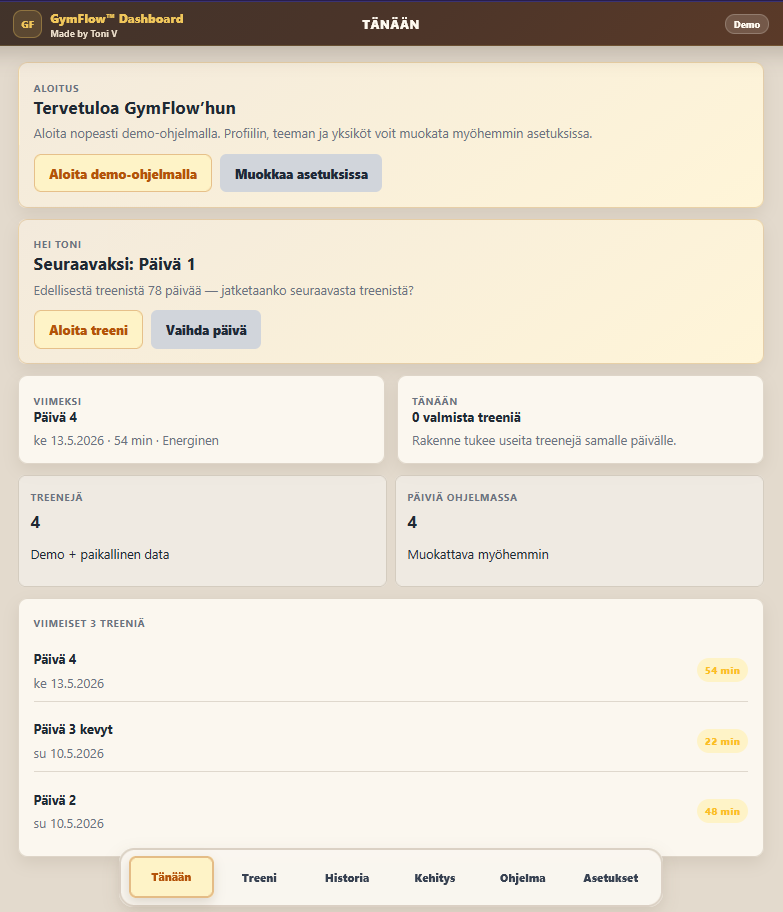
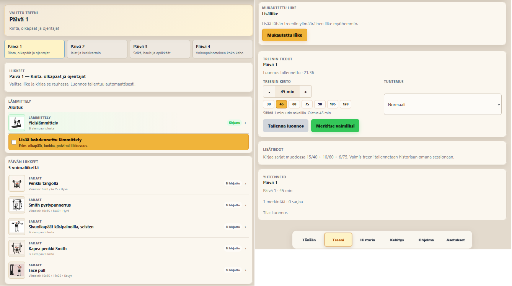
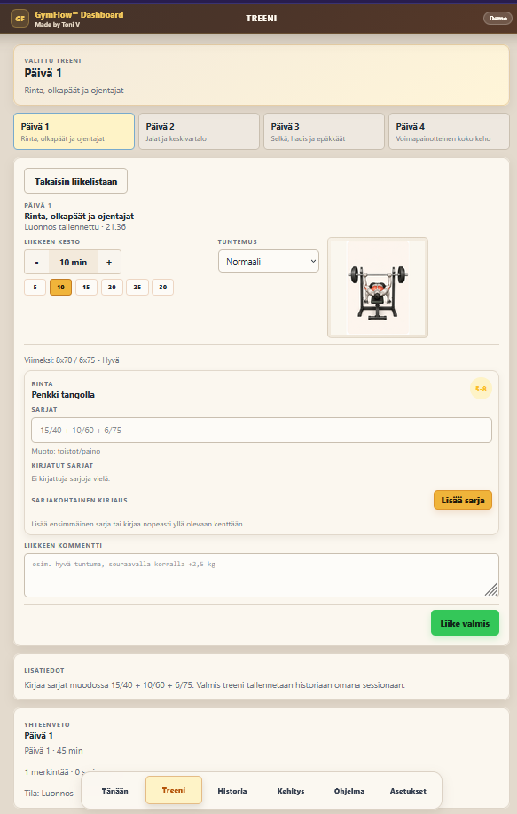
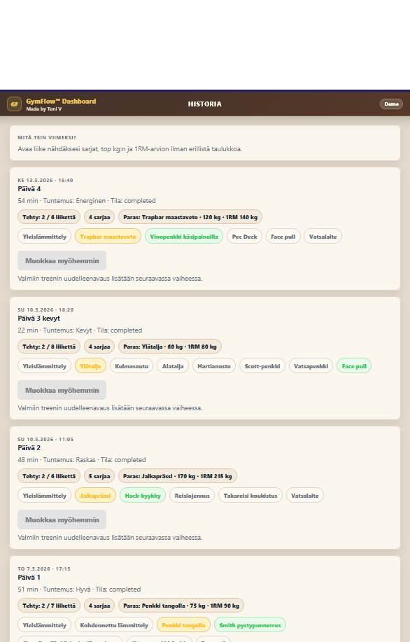
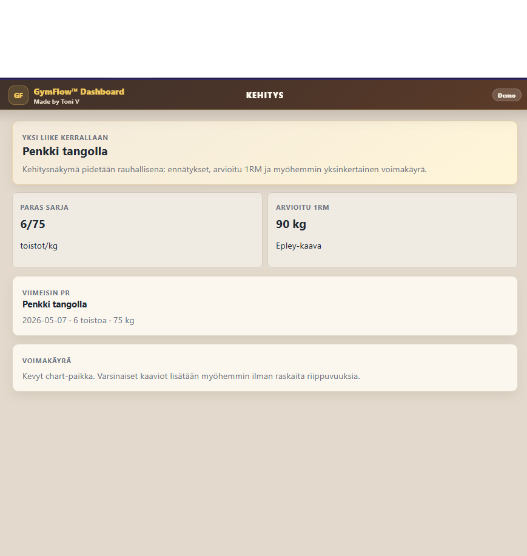
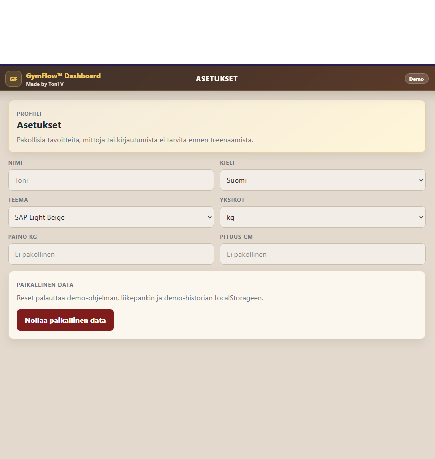
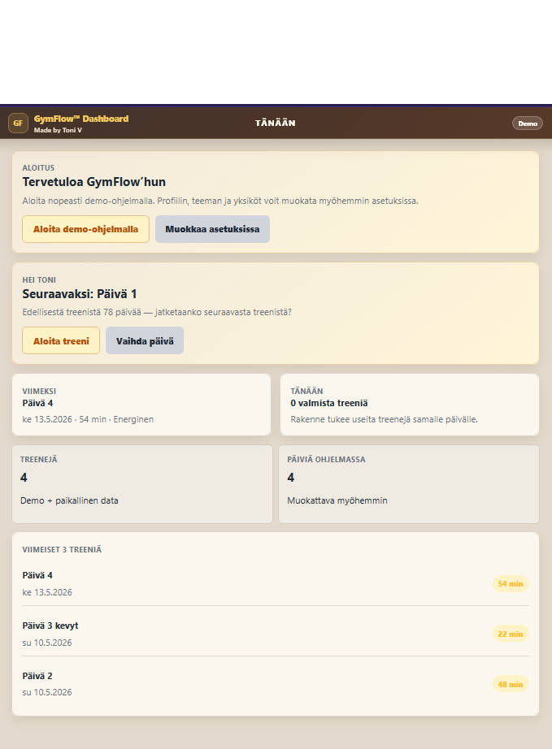

# 🏋️ GymFlow Dashboard

A mobile-first Progressive Web Application (PWA) built as a personal portfolio project for workout planning, exercise tracking and long-term strength progression.

GymFlow is designed around practical gym workflows, providing a fast and intuitive way to manage workouts without the complexity of traditional spreadsheets or fitness applications.

Designed and developed to demonstrate user-centred application design, mobile-first thinking and modern React development.

---

# 🏗️ Architecture

```text
React
      │
JavaScript
      │
Local Storage
      │
Progressive Web App (PWA)
```

---

# 📸 Screenshots

| Home Dashboard | Workout Session | Exercise Detail |
|----------------|-----------------|-----------------|
|  |  |  |

| History | Progress | Settings |
|---------|----------|----------|
|  |  |  |

## 📱 Mobile View



---

# ⚡ Key Features

- 🏋️ Workout Planning
- 💪 Exercise Tracking
- 📈 Progress Monitoring
- 🏆 Personal Records
- 📅 Training History
- 📱 Mobile-first User Experience
- 💾 Offline Storage
- ⚙️ Editable Workout Programs
- 🎯 Reps-first Workout Logging
- 🖼️ Exercise Image Library

---

# ✨ Features

## 🏠 Home Dashboard

The dashboard gives users an immediate overview of their current training status.

Features include:

- Next scheduled workout
- Recent workout summary
- Workout statistics
- Number of workout days
- Quick navigation
- Mobile-first dashboard layout

---

## 💪 Workout Tracking

GymFlow is built around fast workout logging.

Features include:

- Reps-first workout entry
- Exercise-by-exercise tracking
- Set logging
- Workout duration tracking
- Multiple workouts per day
- Workout completion workflow

Example workout entry:

```text
15/40 + 10/60 + 6/75
```

Meaning:

- 15 reps @ 40 kg
- 10 reps @ 60 kg
- 6 reps @ 75 kg

---

## 📝 Exercise Detail

Each exercise includes:

- Exercise information
- Muscle illustration
- Previous workout comparison
- Set history
- Weight and repetition tracking

---

## 📅 Training History

The History page provides:

- Previous workout sessions
- Workout duration
- Completed exercises
- Workout notes
- Chronological training history

---

## 📈 Progress

Progress tracking includes:

- Personal Records (PR)
- Estimated One Rep Max (1RM)
- Training statistics
- Workout progression

---

## 📋 Workout Program

The Program page includes:

- Four-day demo program
- Exercise organisation
- Editable workout structure
- Foundation for future exercise library

---

## ⚙️ Settings

Current settings include:

- User profile
- Theme selection
- Measurement units
- Demo data management

The settings page is designed for future expansion.

---

## 💾 Offline First

GymFlow stores all workout data locally using browser storage.

Benefits include:

- Fast performance
- No login required
- Offline availability
- Immediate workout logging
- Privacy by design

The application is installable as a Progressive Web App (PWA) on supported devices.

---

# 🛠️ Tech Stack

| Layer | Technology |
|--------|------------|
| Frontend | React |
| Language | JavaScript |
| Build Tool | Vite |
| Styling | CSS |
| Storage | localStorage |
| Mobile | Progressive Web App (PWA) |

---

# 🚀 Getting Started

## Prerequisites

- Node.js 16+
- npm

## Installation

Clone the repository:

```bash
git clone https://github.com/Vode72/gymflow-dashboard.git
```

Open the project:

```bash
cd gymflow-dashboard
```

Install dependencies:

```bash
npm install
```

Run development server:

```bash
npm run dev
```

Development server:

```text
http://localhost:5173
```

Build production version:

```bash
npm run build
```

---

# 📁 Project Structure

```text
gymflow-dashboard/

├── public/
│   ├── icons/
│   └── manifest.json
│
├── screenshots/
│
├── src/
│   ├── assets/
│   ├── components/
│   ├── data/
│   ├── hooks/
│   ├── i18n/
│   ├── pages/
│   ├── utils/
│   └── App.jsx
│
├── package.json
└── README.md
```

---

# 🗺️ Roadmap

## Completed ✅

- Mobile-first interface
- Workout Dashboard
- Workout Tracking
- Exercise Tracking
- Exercise Image Library
- Workout History
- Progress View
- Program Management
- Settings
- Progressive Web App
- Offline Storage

## Planned 🔲

- Backup & Restore
- Import / Export
- Calendar View
- Achievements
- Multi-language Support
- Cloud Synchronisation
- Advanced Progress Analytics
- Exercise Library Management
- Workout Templates

---

# 👨‍💻 Author

Built by Toni Voutilainen.

GymFlow Dashboard combines practical strength training experience with modern web development to create a fast, intuitive and mobile-first workout tracking application.

The project demonstrates how user-centred design, structured workout planning and Progressive Web App technologies can be combined into a practical fitness application.

Built with React • JavaScript • Vite • Progressive Web App (PWA)